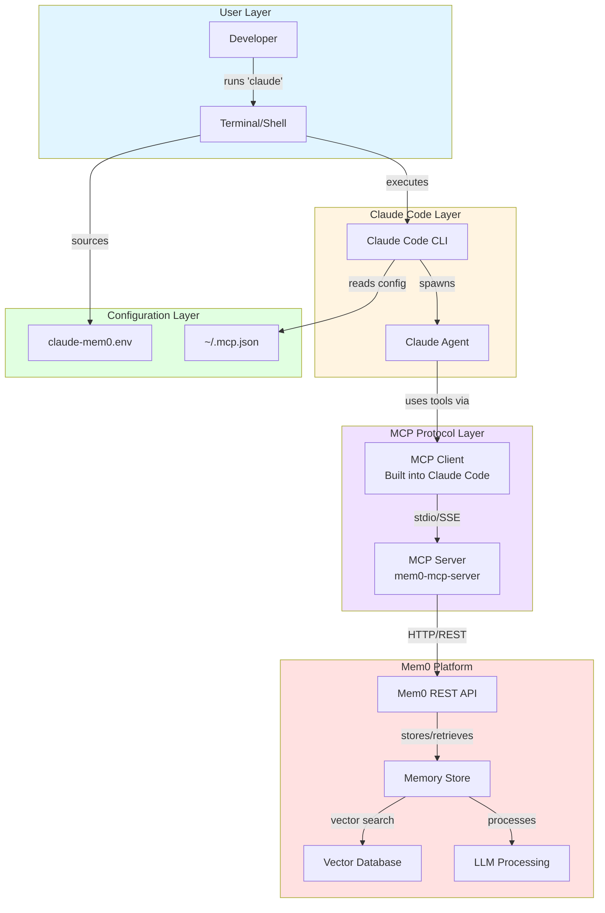
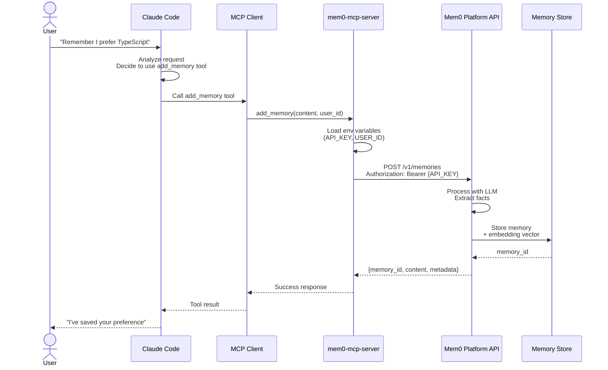
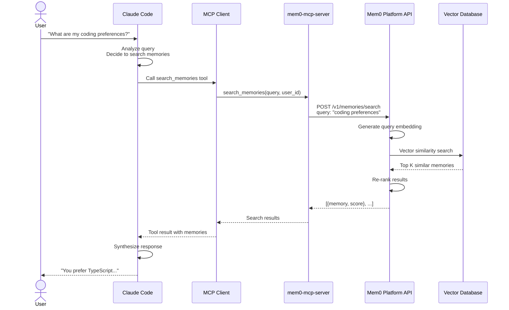
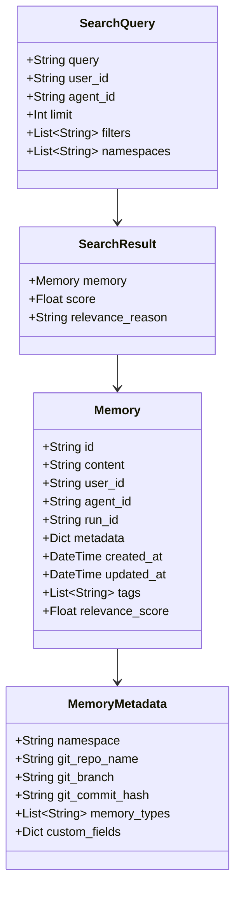
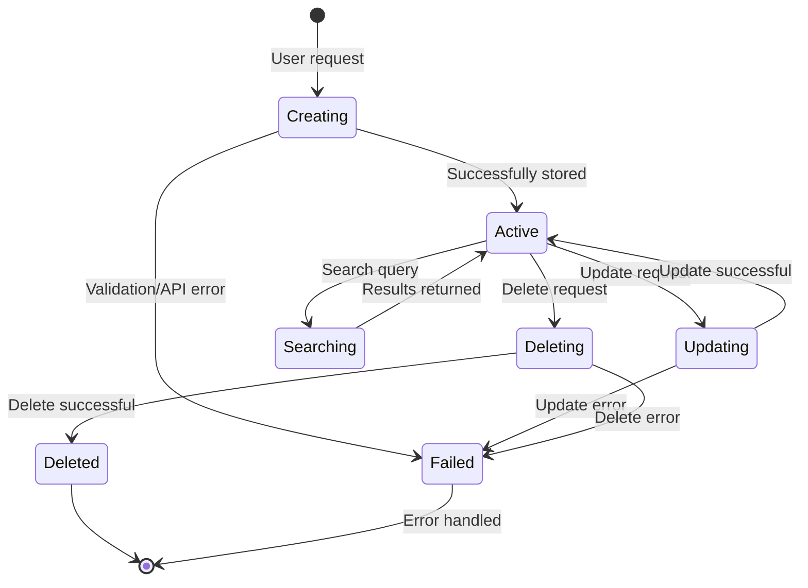
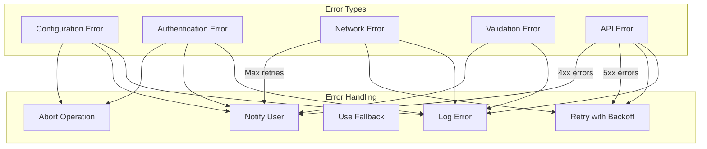
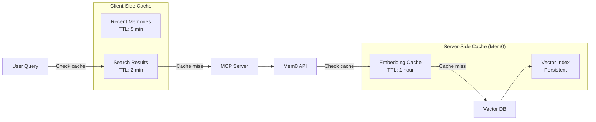
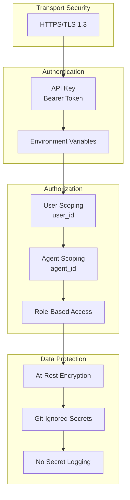
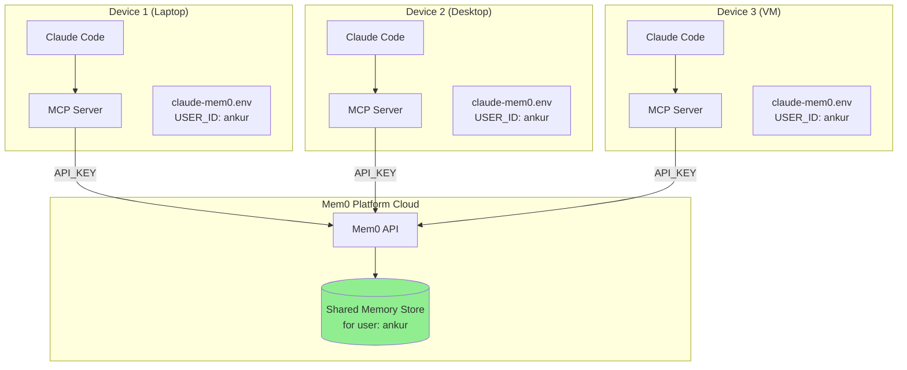
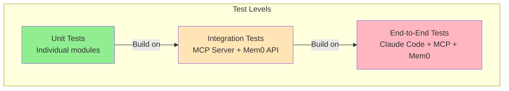

# Low-Level Design: Mem0 + Claude Code Integration

## Overview

This document describes the low-level design for integrating Mem0 Platform with Claude Code to provide persistent, cross-device memory capabilities for AI-assisted coding workflows.

---

## System Architecture

### High-Level Component Diagram



---

## Data Flow

### Memory Add Operation Flow



### Memory Search Operation Flow



---

## Component Details

### 1. Configuration Layer

#### File: `~/.mcp.json`
**Purpose:** MCP server configuration for Claude Code

```json
{
  "mcpServers": {
    "mem0": {
      "command": "uvx",
      "args": ["mem0-mcp-server"],
      "env": {
        "MEM0_API_KEY": "${MEM0_API_KEY}",
        "MEM0_DEFAULT_USER_ID": "${MEM0_DEFAULT_USER_ID}",
        "MEM0_ENABLE_GRAPH_DEFAULT": "${MEM0_ENABLE_GRAPH_DEFAULT:-false}"
      }
    }
  }
}
```

**Responsibilities:**
- Define MCP server command and arguments
- Reference environment variables (not hardcode secrets)
- Configure server behavior via env vars

#### File: `claude-mem0.env`
**Purpose:** Environment variable definitions

```bash
export MEM0_API_KEY="m0-..."
export MEM0_DEFAULT_USER_ID="username"
export MEM0_ENABLE_GRAPH_DEFAULT="false"
```

**Responsibilities:**
- Store sensitive credentials (API keys)
- Define user identity for memory scope
- Configure feature flags

**Security:**
- Git-ignored to prevent credential leakage
- Sourced before Claude Code execution
- Single source of truth for credentials

---

### 2. MCP Protocol Layer

#### MCP Client (Built into Claude Code)
**Responsibilities:**
- Discover available MCP servers from config
- Spawn MCP server processes
- Communicate via stdio/SSE protocol
- Expose tools to Claude Agent
- Handle tool invocations

**Protocol:** Model Context Protocol (MCP)
- Transport: stdio or Server-Sent Events (SSE)
- Message format: JSON-RPC 2.0

#### MCP Server (`mem0-mcp-server`)
**Responsibilities:**
- Expose memory operations as MCP tools
- Validate requests and parameters
- Forward operations to Mem0 Platform API
- Handle authentication via API key
- Return structured responses

**Tools Exposed:**
- `add_memory` - Create new memory
- `search_memories` - Semantic search
- `get_memories` - List with filters
- `get_memory` - Retrieve by ID
- `update_memory` - Modify existing
- `delete_memory` - Remove by ID
- `delete_all_memories` - Bulk delete
- `delete_entities` - Remove entity
- `list_entities` - List stored entities

---

### 3. Mem0 Platform Layer

#### Mem0 REST API
**Endpoint:** `https://api.mem0.ai/v1/`

**Authentication:** Bearer token (API key)

**Key Endpoints:**
- `POST /v1/memories` - Add memory
- `POST /v1/memories/search` - Search memories
- `GET /v1/memories` - List memories
- `GET /v1/memories/{id}` - Get memory
- `PUT /v1/memories/{id}` - Update memory
- `DELETE /v1/memories/{id}` - Delete memory

#### Memory Store
**Responsibilities:**
- Persist memory records
- Manage memory metadata
- Handle memory lifecycle
- Enforce access control per user_id/agent_id

#### Vector Database
**Responsibilities:**
- Store embedding vectors
- Perform similarity search
- Return ranked results

#### LLM Processing
**Responsibilities:**
- Extract structured facts from conversations
- Generate embeddings for queries and memories
- Re-rank search results for relevance

---

## Modular Code Structure

For extensibility and custom tooling, here's a recommended modular structure:

```
mem0-claude-integration/
├── config/
│   ├── __init__.py
│   ├── env_loader.py          # Load and validate environment variables
│   ├── mcp_config.py           # MCP configuration management
│   └── settings.py             # Application settings
│
├── core/
│   ├── __init__.py
│   ├── client.py               # Mem0 API client wrapper
│   ├── models.py               # Data models (Memory, SearchResult, etc.)
│   └── exceptions.py           # Custom exceptions
│
├── memory/
│   ├── __init__.py
│   ├── operations.py           # Memory CRUD operations
│   ├── search.py               # Search and retrieval logic
│   └── filters.py              # Memory filtering utilities
│
├── mcp/
│   ├── __init__.py
│   ├── server.py               # MCP server implementation
│   ├── tools.py                # Tool definitions and handlers
│   └── protocol.py             # MCP protocol helpers
│
├── utils/
│   ├── __init__.py
│   ├── logging.py              # Logging configuration
│   ├── validation.py           # Input validation
│   └── formatters.py           # Response formatting
│
├── scripts/
│   ├── setup.sh                # Initial setup script
│   ├── test_integration.py     # Integration tests
│   └── check_health.py         # Health check utility
│
├── docs/
│   ├── LLD.md                  # This document
│   ├── API.md                  # API documentation
│   └── USAGE.md                # Usage guide
│
├── claude-mem0.env.example     # Environment template
├── claude-mem0.env             # Actual env (git-ignored)
├── requirements.txt            # Python dependencies
└── README.md                   # Project overview
```

### Module Responsibilities

#### `config/` - Configuration Management
```python
# config/env_loader.py
from typing import Optional
import os

class EnvConfig:
    """Load and validate environment variables."""

    def __init__(self):
        self.api_key: str = self._get_required("MEM0_API_KEY")
        self.user_id: str = self._get_required("MEM0_DEFAULT_USER_ID")
        self.enable_graph: bool = self._get_optional("MEM0_ENABLE_GRAPH_DEFAULT", "false") == "true"

    @staticmethod
    def _get_required(key: str) -> str:
        value = os.getenv(key)
        if not value:
            raise ValueError(f"Required environment variable {key} not set")
        return value

    @staticmethod
    def _get_optional(key: str, default: str) -> str:
        return os.getenv(key, default)
```

#### `core/` - Core Abstractions
```python
# core/models.py
from dataclasses import dataclass
from typing import Optional, List, Dict, Any
from datetime import datetime

@dataclass
class Memory:
    """Represents a memory record."""
    id: str
    content: str
    user_id: Optional[str] = None
    agent_id: Optional[str] = None
    metadata: Optional[Dict[str, Any]] = None
    created_at: Optional[datetime] = None
    updated_at: Optional[datetime] = None

@dataclass
class SearchResult:
    """Represents a search result."""
    memory: Memory
    score: float

@dataclass
class SearchResponse:
    """Represents search response."""
    results: List[SearchResult]
    total: int
```

```python
# core/client.py
import requests
from typing import List, Optional, Dict, Any
from .models import Memory, SearchResponse
from config.env_loader import EnvConfig

class Mem0Client:
    """Client for Mem0 Platform API."""

    def __init__(self, config: EnvConfig):
        self.api_key = config.api_key
        self.base_url = "https://api.mem0.ai/v1"
        self.headers = {
            "Authorization": f"Bearer {self.api_key}",
            "Content-Type": "application/json"
        }

    def add_memory(
        self,
        content: str,
        user_id: Optional[str] = None,
        agent_id: Optional[str] = None,
        metadata: Optional[Dict[str, Any]] = None
    ) -> Memory:
        """Add a new memory."""
        payload = {
            "messages": [{"role": "user", "content": content}]
        }
        if user_id:
            payload["user_id"] = user_id
        if agent_id:
            payload["agent_id"] = agent_id
        if metadata:
            payload["metadata"] = metadata

        response = requests.post(
            f"{self.base_url}/memories",
            headers=self.headers,
            json=payload
        )
        response.raise_for_status()
        return Memory(**response.json())

    def search_memories(
        self,
        query: str,
        user_id: Optional[str] = None,
        agent_id: Optional[str] = None,
        limit: int = 10
    ) -> SearchResponse:
        """Search memories."""
        payload = {"query": query, "limit": limit}
        if user_id:
            payload["user_id"] = user_id
        if agent_id:
            payload["agent_id"] = agent_id

        response = requests.post(
            f"{self.base_url}/memories/search",
            headers=self.headers,
            json=payload
        )
        response.raise_for_status()
        return SearchResponse(**response.json())
```

#### `memory/` - Memory Operations
```python
# memory/operations.py
from typing import Optional, List, Dict, Any
from core.client import Mem0Client
from core.models import Memory, SearchResponse

class MemoryOperations:
    """High-level memory operations."""

    def __init__(self, client: Mem0Client, default_user_id: str):
        self.client = client
        self.default_user_id = default_user_id

    def remember(
        self,
        content: str,
        scope: str = "user",
        metadata: Optional[Dict[str, Any]] = None
    ) -> Memory:
        """Remember information."""
        if scope == "user":
            return self.client.add_memory(
                content=content,
                user_id=self.default_user_id,
                metadata=metadata
            )
        elif scope == "project":
            project_id = metadata.get("project_id") if metadata else None
            return self.client.add_memory(
                content=content,
                agent_id=project_id,
                metadata=metadata
            )
        else:
            raise ValueError(f"Invalid scope: {scope}")

    def recall(
        self,
        query: str,
        scope: str = "user",
        limit: int = 5
    ) -> List[Memory]:
        """Recall relevant memories."""
        if scope == "user":
            response = self.client.search_memories(
                query=query,
                user_id=self.default_user_id,
                limit=limit
            )
        elif scope == "project":
            # Assume project context is set in metadata
            response = self.client.search_memories(
                query=query,
                limit=limit
            )
        else:
            raise ValueError(f"Invalid scope: {scope}")

        return [result.memory for result in response.results]
```

#### `mcp/` - MCP Server Implementation
```python
# mcp/tools.py
from typing import Dict, Any, Callable
from memory.operations import MemoryOperations

class MemoryTools:
    """MCP tool implementations."""

    def __init__(self, operations: MemoryOperations):
        self.ops = operations

    def get_tool_definitions(self) -> Dict[str, Callable]:
        """Get all tool definitions."""
        return {
            "add_memory": self.add_memory_tool,
            "search_memories": self.search_memories_tool,
            "get_memories": self.get_memories_tool,
            # ... other tools
        }

    def add_memory_tool(self, content: str, **kwargs) -> Dict[str, Any]:
        """Add memory tool handler."""
        try:
            memory = self.ops.remember(content, **kwargs)
            return {
                "success": True,
                "memory_id": memory.id,
                "content": memory.content
            }
        except Exception as e:
            return {
                "success": False,
                "error": str(e)
            }

    def search_memories_tool(self, query: str, **kwargs) -> Dict[str, Any]:
        """Search memories tool handler."""
        try:
            memories = self.ops.recall(query, **kwargs)
            return {
                "success": True,
                "results": [
                    {"content": m.content, "id": m.id}
                    for m in memories
                ]
            }
        except Exception as e:
            return {
                "success": False,
                "error": str(e)
            }
```

---

## Data Models

### Memory Entity



---

## State Management

### Memory Lifecycle States



---

## Error Handling

### Error Types and Handling Strategy



---

## Performance Considerations

### Caching Strategy



### Optimization Strategies

1. **Batch Operations**
   - Group multiple memory additions
   - Reduce API calls

2. **Lazy Loading**
   - Load full memory details on demand
   - Return metadata first

3. **Connection Pooling**
   - Reuse HTTP connections
   - Reduce connection overhead

4. **Async Operations**
   - Non-blocking memory operations
   - Background processing for non-critical updates

---

## Security Design

### Security Layers



### Best Practices

1. **Never hardcode API keys** - Always use environment variables
2. **Git-ignore sensitive files** - `claude-mem0.env` must be in `.gitignore`
3. **Rotate keys regularly** - Generate new API keys periodically
4. **Scope access appropriately** - Use `user_id` and `agent_id` correctly
5. **Validate inputs** - Sanitize before sending to API
6. **Use HTTPS only** - Never transmit over unsecured connections

---

## Deployment Architecture

### Cross-Device Deployment



**Key Points:**
- Same `USER_ID` across all devices = shared memory
- Same `API_KEY` for authentication
- Cloud-based sync ensures consistency
- No local storage conflicts

---

## Testing Strategy

### Test Pyramid



### Test Scenarios

1. **Unit Tests**
   - Config loading and validation
   - Memory model serialization
   - Error handling logic

2. **Integration Tests**
   - MCP server tool invocation
   - Mem0 API calls
   - Response parsing

3. **End-to-End Tests**
   - Full workflow: Claude Code → MCP → Mem0
   - Memory persistence and retrieval
   - Cross-device sync

---

## Monitoring and Observability

### Key Metrics

1. **Performance Metrics**
   - API response time
   - Memory operation latency
   - Cache hit rate

2. **Reliability Metrics**
   - Success rate
   - Error rate by type
   - Retry attempts

3. **Usage Metrics**
   - Memories created per day
   - Search queries per day
   - Active users

### Logging Strategy

```python
# utils/logging.py
import logging
from typing import Any

class MemoryLogger:
    """Structured logging for memory operations."""

    def __init__(self):
        self.logger = logging.getLogger("mem0-claude")
        self.logger.setLevel(logging.INFO)

    def log_operation(
        self,
        operation: str,
        user_id: str,
        success: bool,
        **kwargs: Any
    ):
        """Log memory operation."""
        self.logger.info(
            f"Operation: {operation}",
            extra={
                "operation": operation,
                "user_id": user_id,
                "success": success,
                **kwargs
            }
        )
```

---

## Future Enhancements

### Potential Extensions

1. **Local Caching Layer**
   ```
   Claude Code → Local Cache → MCP → Mem0
   - Offline support
   - Faster retrieval
   ```

2. **Memory Compression**
   - Summarize old memories
   - Reduce storage costs

3. **Advanced Search**
   - Temporal filtering
   - Tag-based organization
   - Relationship graphs

4. **Multi-Agent Collaboration**
   - Shared agent memories
   - Team workspaces

5. **Analytics Dashboard**
   - Memory usage insights
   - Search patterns
   - Productivity metrics

---

## Appendix

### Glossary

- **MCP**: Model Context Protocol - Standard for AI tool integration
- **Memory**: A stored piece of information with context
- **User ID**: Identifier for personal memory scope
- **Agent ID**: Identifier for project/agent-specific memory
- **Run ID**: Identifier for session-specific memory
- **Namespace**: Logical grouping of memories
- **Embedding**: Vector representation of text for similarity search

### References

- [Claude Code Documentation](https://code.claude.com/docs/en/overview)
- [Mem0 Platform Documentation](https://docs.mem0.ai)
- [Model Context Protocol Specification](https://modelcontextprotocol.io)
- [Mem0 MCP Server Repository](https://github.com/mem0ai/mem0-mcp)

---

**Document Version:** 1.0
**Last Updated:** January 7, 2026
**Author:** AI Assistant
**Status:** Draft
